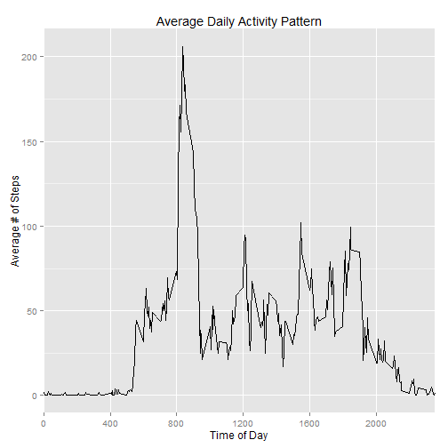
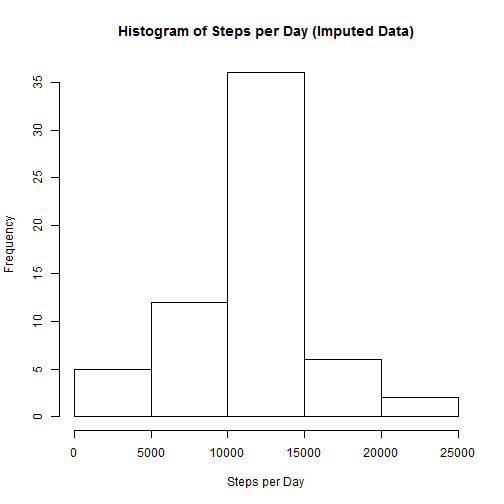

Scott Arendt

Coursera - Johns Hopkins Data Science Specialization

Reproducible Research

Peer Assessment 1


```r
library(ggplot2)
```

## Loading and preprocessing the data

The dataset for this assigment can be downloaded from [here][1].

[1]: https://d396qusza40orc.cloudfront.net/repdata%2Fdata%2Factivity.zip


```r
# Here is the code to download and unzip the raw data.
# If the zipped data file is not found locally, then download it.
# This script should work without regard to the directory in which it is run

ZippedDataFile <- "./data.zip"
ZippedDataLocation <- "http://d396qusza40orc.cloudfront.net/repdata%2Fdata%2Factivity.zip"
DataFile <- "Activity.csv"
if (!file.exists(ZippedDataFile))
{
  download.file(ZippedDataLocation, destfile = ZippedDataFile, mode = "wb")
}

# If the unzipped data file does not exist, unzip it
 if (!file.exists(DataFile))
 {
   unzip("data.zip")
 }

RawActivityData <- read.csv("Activity.csv")
```

## What is mean total number of steps taken per day?

For this part of the assignment, you can ignore the missing values in the dataset.


```r
# setwd("ReproducibleResearch/PA1")

# Run a few functions on the raw data to get a feel for it
# summary(RawActivityData)
# sapply(RawActivityData,mode)
# str(RawActivityData)
 
TotalRawStepsPerDay <- aggregate(RawActivityData$steps
    , by = list(RawActivityData$date)
    , FUN = sum
    , na.rm=TRUE)
```

1. Make a histogram of the total number of steps taken each day.


```r
hist(TotalRawStepsPerDay$x
    , xlab="Steps per Day"
    , main="Histogram of Steps per Day")
```

 

2. Calculate and report the mean and median total number of steps each day.


```r
TotalRawMean <- mean(TotalRawStepsPerDay$x)
TotalRawMedian <- median(TotalRawStepsPerDay$x)
```

The mean of the total steps per day is 9354.2295082

The median of the total steps per day is 10395


## What is the average daily activity pattern?
Based on the ordering of the assignment questions, I am assuming that this question does not require imputing for NA's.

1. Make a time series plot (i.e. type = "l") of the 5-minute interval (x-axis) and the average number of steps taken, averaged across all days (y-axis).


```r
AvgStepsPerInterval <- aggregate(RawActivityData$steps
    , by = list(RawActivityData$interval)
    , FUN = mean
    , na.rm=TRUE)
names(AvgStepsPerInterval)[1] <- "interval"
names(AvgStepsPerInterval)[2] <- "avgsteps"

a <- ggplot(data = AvgStepsPerInterval, aes(x = interval, y = avgsteps))
a <- a + ggtitle("Average Daily Activity Pattern") 
a <- a + xlab("Time of Day") + ylab("Average # of Steps")
a <- a + geom_line()
a <- a + scale_x_discrete(breaks=seq(0, 2400, by=400))
a 
```

 

2. Which 5-minute interval, on average across all the days in the dataset, contains the maximum number of steps?


```r
MaxAvgSteps <- max(AvgStepsPerInterval$avgsteps)

MaxAvgStepsInterval <- AvgStepsPerInterval$interval[which(AvgStepsPerInterval$avgsteps == max(AvgStepsPerInterval$avgsteps))]
```

The highest average for any given interval is 206.1698113, but the question is looking for the interval identity.  It looks like this person is cranking out time on the treadmill at 835 in the morning.


## Imputing missing values


1. Calculate and report the total number of missing values in the dataset (i.e. the total number of rows with NAs)


```r
NACount <- sum(is.na(RawActivityData))
```

There are 2304 NA values in the dataset.

2. Devise a strategy for filling in all of the missing values in the dataset.  The strategy does not need to be sophisticated.  For example, you could use the mean/median for that day, or the mean for that 5-minute interval, etc.


I worked through some ideas when I saw this part of the assignement "The strategy does not need to be sophisticated."  I changed my plan from something sophisticated to something simple.  I am going to replace all NA with the median number of steps per interval. As I write this, I do not know how it will affect the results and am curious if it will provide a desired minimal impact.

3. Create a new dataset that is equal to the original dataset, but with the missing data filled in.


```r
# Determine the average number of steps for all values.
AvgStepsOverall <- mean(RawActivityData$steps, na.rm=TRUE)
# Make a copy of the data
ImputedActivityData <- RawActivityData
# Replace the NAs with the average number of steps
ImputedActivityData[is.na(ImputedActivityData)] <- AvgStepsOverall
```

4. Make a histogram of the total number of steps taken each day and Calculate and report the mean and median total number of steps per day.  Do these values differe from the estimates from the first part of the assignment?  What is the impact of imputing missing data on the estimates of the total daily number of steps?


```r
TotalImputedStepsPerDay <- aggregate(ImputedActivityData$steps
    , by = list(ImputedActivityData$date)
    , FUN = sum
    , na.rm=TRUE)

hist(TotalImputedStepsPerDay$x
    , xlab="Steps per Day"
    , main="Histogram of Steps per Day (Imputed Data)")
```

 

Looks like the histogram for the imputed data has been affected.  The frequency of the middle bar has increased by the number of days that were imputed.


```r
TotalImputedMean <- mean(TotalImputedStepsPerDay$x)
TotalImputedMedian <- median(TotalImputedStepsPerDay$x)
```

The mean of the total steps per day after imputing is 1.0766189 &times; 10<sup>4</sup>

The median of the total steps per day after imputing is 1.0766189 &times; 10<sup>4</sup>

Both the mean and median increased when the data was imputed.

## Are there differences in activity patterns between weekdays and weekends?

I simply have run out of time.  Therefore, I have not included any code or analysis of pattern differences between weekdays and weekends.
